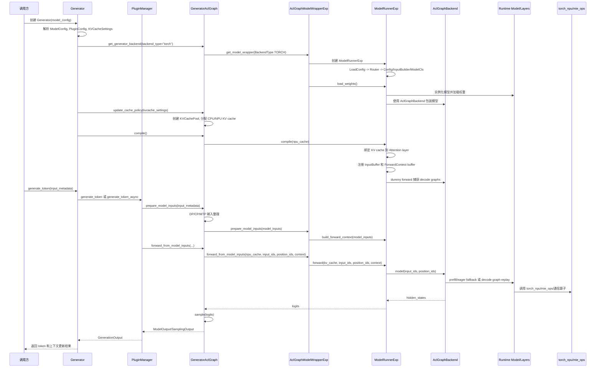
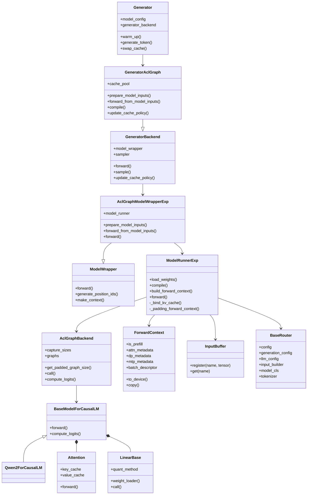

# ACLGraph Backend 设计文档

## 1. 背景

### 1.1 ATB Graph 方案的不足

当前仓库同时保留了 ATB backend 和 ACLGraph backend 两套推理后端。ATB backend 通过 `backend_type="atb"` 选择，主要入口位于 `mindie_llm/modeling/model_wrapper/atb/atb_model_wrapper.py`，底层依赖 `examples/atb_models/atb_llm`、`examples/atb_models/atb_framework` 以及 ATB 图和算子封装。

ATB Graph 方案能够提供高性能图模式推理能力，但从新模型接入、现场交付和长期演进看，存在以下不足：

1. 易用性问题，需要编译。ATB backend 的新模型或新特性适配通常涉及 Python runner、C++ layer、C++ model、operation graph、算子注册和编译产物，开发者需要维护 Python 与 C++ 两套实现边界。客户现场如果只是修改模型结构、配置或轻量特性，也可能需要重新编译和验证，交付链路较重。
2. Plugin Manager 违反依赖倒置原则。插件层作为上层编排能力，本应依赖稳定抽象接口；但在 ATB Graph 路径中，插件逻辑容易感知具体 backend、model wrapper、runner 参数和底层能力差异。高层模块依赖低层实现细节后，新增插件或切换 backend 都会扩大改动面。
3. KV cache 显存申请位于 Text Generator，泛化性不高。当前 KV cache 申请逻辑主要在 text generator 中实现，Text Generator 需要提前感知 runtime 层的层数、head、head size、block size、cache dtype 等参数，并将这些参数层层透传到 wrapper、runner 和 layer。该模式默认层间 cache shape 一致，不利于支持 compress KV、MLA/SFA 等层间 KV cache spec 不一致的模型，也不利于 runtime 根据模型结构自行决定 cache 布局。
4. 异步调度只能掩盖 Text Generator 层处理时间。ATB backend 的异步调度可以减少 host 侧 text generator 编排带来的等待，但如果 modeling 内部存在 metadata 构造、数据搬运、算子间同步或 graph 执行断流，单纯在 text generator 层异步化无法完全消除 token 间空泡。

### 1.2 ACLGraph 方案的修改内容

ACLGraph backend 在保留图模式推理能力的同时，将模型适配、数据处理、KV cache 管理和编译流程重新收敛到 runtime 侧，主要修改内容如下：

1. 模型权重加载与适配。
   - 提供 `Linear`、`Embedding`、`Norm`、`AttentionBackend`、`MoE` 等基础 Custom Layer，支持 auto quant、auto parallel 和 auto LoRA。
   - 感知 SoC 和算子能力，自动选择更合适的数据布局，完成亲和性转置和权重 NZ 转化。
   - 支持逐 tensor 加载权重，减少 CPU 内存占用；模型组网、warmup 和 compile 流程不强依赖真实权重，便于快速验证结构和图捕获链路。
2. 模型组网及推理接口。
   - 基于 Custom Layer 和 `torch` 接口进行模型组网，并支持 MTP。
   - 按需实现 `input_builder`、`router`、`config`、`tool_call_parser`，用于定义模型特殊配置、输入构造、路由选择和数据前后处理逻辑。
3. Warmup 能力保持兼容并增强。
   - 现有 warmup 能力保持不变。
   - 支持 `npuMemSize=-1`，支持 `NPU_MEM_FRACTION` 配置。
   - 支持 RAS OOM 故障快速恢复。
4. 加入 compile 流程。
   - 复用 capture & replay 能力，对 decode 阶段进行图捕获和 replay。
   - 接入多个融合算子，减少算子调度和中间数据开销。
5. Custom Ops 能力扩展。
   - 支持 C++ kernel，接入 Ascend C 算子。
   - 支持 Python kernel，接入 Triton 算子。
6. KV cache 代码优化。
   - 将 KV cache 申请逻辑下沉至 `ModelRunner`，由 runtime 根据模型结构和 layer 需求决定 cache spec。
   - 支持 compress KV，支持层间 KV cache spec 不一致。
7. 数据处理逻辑归一至 `ModelRunner`。
   - `ModelWrapper` 中的数据处理逻辑下沉至 `ModelRunner`。
   - `FlashCausalLM` 中的数据处理逻辑上移至 `ModelRunner`。
   - 通过统一入口降低 text generator、model wrapper、modeling 之间的参数透传和重复处理。
8. 性能优化。
   - 通过更完整的异步调度消除 token 间空泡，覆盖 text generator 和 modeling 内部处理时间。
   - 优化 MTP 空泡，降低 draft 和 target 模型之间的等待。

### 1.3 ATB backend 与 ACLGraph backend 的区别

| 维度 | ATB backend | ACLGraph backend |
| --- | --- | --- |
| 配置选择 | `backend_type="atb"` | 当前代码中由 `backend_type="torch"` 选择 |
| Text Generator adapter | `GeneratorTorch` 或 `GeneratorTorchAsync` | `GeneratorAclGraph` |
| Model Wrapper | `ATBModelWrapper` | `AclGraphModelWrapperExp`，兼容保留 `AclGraphModelWrapper` |
| Runtime | `atb_llm.runner.ModelRunner` | `mindie_llm.runtime.model_runner.ModelRunnerExp` |
| 模型组织方式 | ATB graph 和 ATB operation 形态 | PyTorch `nn.Module` 形态 |
| 图模式 | 由 ATB graph runtime 承载 | 由 `torch.npu.NPUGraph` 和 `AclGraphBackend` 捕获 decode 图 |
| 算子对接 | ATB operation、aclnn、ATB framework 封装 | runtime layers 直接调用 `torch`、`torch_npu`、`torch.ops.mie_ops` 和通信算子 |
| 模型适配位置 | `examples/atb_models` 为主 | `mindie_llm/runtime/models`、`mindie_llm/runtime/layers` 为主 |
| 上下文传递 | ATB runner 参数和 ATB graph tensor map | `ForwardContext`、attention metadata、DP metadata、MTP metadata |

### 1.4 为什么需要 ACLGraph backend

ACLGraph backend 的核心目标是在性能尽量持平 ATB backend 的前提下，提供免编译、易适配、易交付的模型后端能力。它不是替代 ATB backend 的低性能调试路径，而是面向快速模型接入和现场交付的图模式推理方案。

1. 性能持平 ATB backend。ACLGraph backend 仍然保留图模式执行能力，prefill 阶段可保持 eager 执行，decode 阶段通过 `AclGraphBackend` 对固定 capture size 的 batch 进行 NPU Graph capture 和 replay，从而在保证灵活性的同时对齐 ATB backend 的推理性能。
2. 免编译，降低交付成本，适合客户现场适配，支持快速适配定制特性。ATB backend 的新模型或新特性适配往往涉及 C++ layer、operation graph 和编译产物，交付链路较长。ACLGraph backend 以 Python runtime model 和 `torch_npu` 算子调用为主，适配完成后通常不需要重新编译 C++ 后端，对编译环境、构建链路和版本窗口的依赖更少，能显著缩短开发、验证和交付周期。
3. 易用性更高，适合 0 day 模型适配。新模型可以按 PyTorch `nn.Module` 方式实现，复用 `BaseModelForCausalLM`、runtime layer、weight loader、router、input builder 和 Hugging Face 配置解析。面对新发布模型时，可优先完成 ACLGraph 路径接入，快速形成可运行、可验证、可服务化的版本。

> 术语说明：当前仓库的公开配置仍使用 `backend_type="torch"` 进入 ACLGraph backend，这是历史命名。本文档中提到的 ACLGraph backend 均指当前 `BackendType.TORCH` 分支对应的实现。

## 2. 总体架构

### 2.1 架构分层

ACLGraph backend 在当前仓库中的主链路如下：

```text
Server / LLM Manager / Scheduler
        |
        v
Text Generator
  Generator
  PluginManager
  Sampler
        |
        v
GeneratorAclGraph
        |
        v
AclGraphModelWrapperExp
        |
        v
ModelRunnerExp
  LoadConfig / Router / MindIELLMConfig
  ForwardContext / InputBuffer / KV cache binding
        |
        v
AclGraphBackend
  torch.npu.NPUGraph capture / replay
        |
        v
Runtime Model and Layers
  Attention / Linear / Embedding / MoE / Norm / RoPE
        |
        v
Operators
  torch / torch_npu / mie_ops / distributed communication
```

向上看，ACLGraph backend 对 Text Generator 暴露与其他 backend 基本一致的能力：准备模型输入、执行 forward、sample、KV cache 策略更新、warmup、compile、异常恢复。Text Generator 通过 `get_generator_backend()` 选择 `GeneratorAclGraph`，不直接依赖 `ModelRunnerExp` 和具体模型类。

向下看，ACLGraph backend 不再构建 ATB operation graph，而是让 runtime model 保持 `nn.Module` 形式。`AclGraphBackend` 作为编译层包装模型，在 decode 场景下捕获并 replay NPU Graph。模型中的 Attention、Linear、Embedding、MoE 等 layer 通过 `ForwardContext` 获得 batch、seq len、block table、DP、MTP 等元数据，再调用底层 NPU 算子。

### 2.2 关键模块职责

| 模块 | 代表文件 | 职责 |
| --- | --- | --- |
| 后端选择 | `mindie_llm/text_generator/adapter/__init__.py` | 根据 `ModelConfig.backend_type` 选择 generator backend |
| Text Generator | `mindie_llm/text_generator/generator.py` | 统一编排配置、插件、KV cache、warmup、generate_token 和 recovery |
| ACLGraph adapter | `mindie_llm/text_generator/adapter/generator_aclgraph.py` | 适配 text generator 与 aclgraph model wrapper，处理 KV cache pool、DP/CP 输入整理、compile |
| Model Wrapper | `mindie_llm/modeling/model_wrapper/aclgraph/aclgraph_model_wrapper_exp.py` | 屏蔽 runtime runner 细节，提供 `prepare_model_inputs`、`forward_from_model_inputs` 等接口 |
| Runtime Runner | `mindie_llm/runtime/model_runner/model_runner_exp.py` | 加载模型、构造 context、绑定 KV cache、执行 eager 或 graph forward |
| Graph Backend | `mindie_llm/runtime/compilation/aclgraph_backend.py` | 管理 capture size、NPU Graph capture、graph replay 和 eager fallback |
| Runtime Context | `mindie_llm/runtime/model_runner/forward_context_exp.py` | 统一传递 attention、DP、MTP、batch descriptor 等元数据 |
| Input Buffer | `mindie_llm/runtime/model_runner/input_buffer.py` | 为 graph capture 提供固定地址输入和 metadata buffer |
| Runtime Model | `mindie_llm/runtime/models` | 以 PyTorch `nn.Module` 方式组织具体模型 |
| Runtime Layers | `mindie_llm/runtime/layers` | 提供 Attention、Linear、Embedding、MoE、Norm、RoPE、Quant 等通用层 |

### 2.3 时序图



### 2.4 类图



## 3. 详细设计

### 3.1 Text Generator 设计

#### 3.1.1 后端选择

`mindie_llm/modeling/backend_type.py` 定义 `BackendType.ATB` 和 `BackendType.TORCH`。当前实现中：

- `BackendType.ATB` 对应 ATB backend。
- `BackendType.TORCH` 对应 ACLGraph backend。

Text Generator 的后端选择在 `mindie_llm/text_generator/adapter/__init__.py`：

- `backend_type == BackendType.TORCH` 时返回 `GeneratorAclGraph`。
- `backend_type == BackendType.ATB` 时返回 `GeneratorTorch` 或 `GeneratorTorchAsync`。

Model Wrapper 的选择在 `mindie_llm/modeling/model_wrapper/__init__.py`：

- `BackendType.TORCH` 时返回 `AclGraphModelWrapperExp` 或兼容保留的 `AclGraphModelWrapper`。
- `BackendType.ATB` 时返回 `ATBModelWrapper`。

`Generator.__init__` 在识别到 `backend_type == "torch"` 时会设置 `ENV.model_runner_exp=True`，因此默认进入 `AclGraphModelWrapperExp + ModelRunnerExp` 组合。

#### 3.1.2 Generator 初始化流程

`mindie_llm/text_generator/generator.py` 负责统一初始化：

1. 将外部 dict 转换为 `ModelConfig`。
2. 解析并校验 backend、rank、world size、parallel、memory、max length、plugin 等配置。
3. 初始化 `ContextParams`、`TGInferContextStore`、`KVCacheSettings`。
4. 通过 `get_generator_backend()` 创建 `GeneratorAclGraph`。
5. 从 backend 暴露 `model_wrapper`、`model_info`、`tokenizer`、`sampler` 等对象。
6. 初始化 `PluginManager`，使 prefix cache、splitfuse、MTP、memory decoding、lookahead decoding 等能力都通过统一生成链路介入。
7. 调用 `generator_backend.update_cache_policy()` 分配 KV cache。

这使 Text Generator 不感知具体模型类型，也不感知 graph capture 的细节。它只面向 generator backend 的统一能力编排推理流程。

#### 3.1.3 生成流程

ACLGraph backend 下的生成流程分为三个阶段：

1. 输入准备。
   - `Generator.generate_token()` 调用 `PluginManager.generate_token()` 或异步路径。
   - 插件层根据特性改写或补充 `InputMetadata`。
   - `GeneratorAclGraph.prepare_model_inputs()` 将 `InputMetadata` 转为 runtime 所需的 `ModelInput`，处理 DP rank、CP 切分、MTP gather index、q_lens、padding 等信息。

2. 模型前向。
   - `AclGraphModelWrapperExp.prepare_model_inputs()` 将 `input_ids`、`position_ids` 等字段转换到 device tensor，并调用 `ModelRunnerExp.build_forward_context()` 构造 `ForwardContext`。
   - `GeneratorAclGraph.forward_from_model_inputs()` 将 `npu_cache`、输入 tensor、`ForwardContext` 传入 `AclGraphModelWrapperExp.forward_from_model_inputs()`。
   - `ModelRunnerExp.forward()` 决定走 eager 或 ACLGraph replay，最终返回 logits。

3. 采样与上下文更新。
   - `GeneratorAclGraph` 复用 `GeneratorBackend.sample()` 中的 `Sampler`。
   - `PluginManager` 负责插件状态更新、draft token 处理、输出过滤和上下文缓存维护。
   - `Generator` 返回 `GenerationOutput`。

#### 3.1.4 Warmup 与 Compile

ACLGraph backend 的 warmup 分两层：

- `Generator.warm_up()` 层：为服务层提供统一 warmup 入口。ACLGraph 路径会先打开 `set_eager_mode_with_padding(True)` 做 warmup 和 profile，再关闭 eager padding，并调用 `generator_backend.compile()`。
- `ModelRunnerExp.compile()` 层：绑定 KV cache，初始化 input buffer 和 context buffer，执行 `_warm_up_and_compile()`。其中会按 capture size 构造 dummy input，调用 `AclGraphBackend` 捕获 decode 图。

prefill 由于 token 数量和 attention metadata 变化更大，默认走 eager。decode 阶段 token 数更稳定，适合按 capture size 捕获图并 replay。

#### 3.1.5 KV Cache 管理

`GeneratorAclGraph.update_cache_policy()` 使用 `KVCachePool` 分配 CPU/NPU KV cache：

- 依据 `KVCacheSettings` 和 `ModelInfo` 计算层数、KV head、head size、block size、dtype。
- 为普通 KV cache 分配 key/value cache。
- 对 SFA/MLA 等需要 index cache 的模型，额外维护 index cache。
- 在 PD 分离场景下，将 cache 地址注册给 separate deployment worker，便于 prefill 和 decode 进程间传递 KV。

`ModelRunnerExp._bind_kv_cache()` 会遍历全局 attention layer 注册表，将 `key_cache`、`value_cache`、必要时的 `index_cache` 绑定到每一层 `Attention` 实例。

### 3.2 Runtime 接口设计

#### 3.2.1 AclGraphModelWrapperExp

`AclGraphModelWrapperExp` 是 text generator 与 runtime runner 之间的适配层。核心接口如下：

| 接口 | 说明 |
| --- | --- |
| `__init__(...)` | 创建 `ModelRunnerExp`，透传模型路径、rank、world size、NPU device、parallel、plugin、sampler 等参数 |
| `prepare_model_inputs(model_inputs, **kwargs)` | 将 Python/numpy 输入转换为 device tensor，构造 `ForwardContext`，并把 runtime 需要的额外字段写回 `model_inputs` |
| `forward_from_model_inputs(npu_cache, input_ids, position_ids, forward_context, **kwargs)` | 调用 `ModelRunnerExp.forward()`，返回 logits、hidden states 或 draft tokens |
| `forward(model_inputs, npu_cache, **kwargs)` | 兼容旧调用方式，内部先 prepare 再 forward |
| `generate_position_ids(...)` / `make_context(...)` | 透传到 runtime input builder/tokenizer 相关能力 |

Wrapper 的价值是保持 text generator 的调用面稳定。后续 runtime 内部切换 capture 策略、metadata 结构或模型类时，优先在 wrapper 和 runner 内部收敛改动。

#### 3.2.2 ModelRunnerExp

`ModelRunnerExp` 是 ACLGraph backend 的 runtime 核心。主要职责如下：

| 接口 | 说明 |
| --- | --- |
| `load_weights()` | 通过 router 获取 model class，在目标 device 和 dtype 下实例化模型，并通过 `DefaultModelLoader` 加载权重 |
| `compile(kv_caches)` | 绑定 KV cache，注册 input/context buffer，执行 decode graph capture |
| `build_forward_context(model_inputs, **kwargs)` | 根据 `ModelInput` 构造 `ForwardContext`，生成 attention metadata、DP metadata、MTP metadata 和 batch descriptor |
| `forward(kv_caches, input_ids, position_ids, forward_context, mtp_step=0, **kwargs)` | 执行模型前向，处理 KV cache 变化、padding、context 设置、logits 计算和 DP/CP gather |
| `generate_position_ids(...)` | 透传到 input builder，保证 tokenizer/input builder 与模型一致 |

`ModelRunnerExp.forward()` 的关键判断逻辑：

- 如果 KV cache 指针或 shape 变化，重新绑定 cache，并重置 buffer/warmup 状态。
- 如果 ACLGraph 启用、当前不是 prefill、且不是 MTP step，则根据 `AclGraphBackend.get_padded_graph_size()` 将 decode batch padding 到已捕获 size。
- 设置全局 `ForwardContext`，使 layer 在不扩展 forward 函数签名的情况下读取 attention、DP、MTP 等元数据。
- 调用模型 `self.model(input_ids, position_ids)`。当 `self.model` 已被 `AclGraphBackend` 包装时，该调用会自动选择 eager 或 graph replay。
- 根据 `lm_head_indices`、TP/DP/CP 通信策略计算并返回 logits。

#### 3.2.3 ForwardContext 与 InputBuffer

`ForwardContext` 是 ACLGraph backend 的上下文总线，包含：

- `is_prefill`：区分 prefill 和 decode。
- `attn_metadata` / `attn_metadata_dict`：Attention 后端所需的 seq len、block table、slot mapping、mask、actual seq len 等信息。
- `dp_metadata`：DP 分片、padding、gather/unpad 所需信息。
- `mtp_metadata`：MTP draft 模型和 gather index 所需信息。
- `batch_descriptor`：graph capture 和 replay 的 key，包括 padded token 数以及 flash communication 是否启用。
- `num_actual_tokens`：padding 前真实 token 数，用于输出裁剪。

`InputBuffer` 用于解决 graph capture 对输入地址稳定性的要求。Runtime 在 compile 或首次 forward 时注册 `input_ids`、`position_ids` 和 metadata buffer。decode 阶段需要 padding 时，`ModelRunnerExp._padding_forward_context()` 将真实输入拷贝到固定 buffer，再让 graph replay 使用固定地址。

#### 3.2.4 AclGraphBackend

`AclGraphBackend` 是 `torch.npu.NPUGraph` 的封装层。它维护：

- `capture_sizes`：按 token 数生成的捕获规格，当前形态为小 batch 的 `1, 2, 4` 加上以 8 为步长的 capture size，最后包含最大 token 数。
- `graphs`：以 `BatchDescriptor` 为 key 保存已捕获的 NPU Graph。
- `output_buffer`：保存每个 graph replay 的输出 tensor。
- 全局 graph memory pool：用于减少多 graph 捕获时的内存碎片。

执行策略：

1. eager fallback：
   - `ForwardContext.is_prefill=True`。
   - 开启 eager padding 模式。
   - `num_actual_tokens` 大于最大 capture size。
2. graph capture：
   - 当 decode 请求命中某个 `BatchDescriptor` 且 graph 尚未捕获时，要求 capture 已启用。
   - 在 `torch.npu.graph(..., auto_dispatch_capture=True)` 作用域中执行模型并保存输出 buffer。
3. graph replay：
   - 将当前输入和 metadata 拷贝到固定 buffer。
   - 对支持的 attention metadata 使用 `graph.update()` 更新 actual seq len。
   - 调用 `graph.replay()`。
   - 返回 `output_buffer[:num_actual_tokens]`，裁剪掉 padding token。

### 3.3 Config 配置设计

ACLGraph backend 涉及四层配置。

#### 3.3.1 服务侧 ModelConfig

`mindie_llm/text_generator/utils/config.py` 中的 `ModelConfig` 是 text generator 的入口配置，关键字段包括：

- `backend_type`：当前使用 `"torch"` 进入 ACLGraph backend。
- `model_id`：模型路径或模型标识。
- `rank`、`local_rank`、`world_size`、`npu_device_id`：分布式和设备信息。
- `max_seq_len`、`max_input_len`、`max_prefill_tokens`、`max_iter_times`：序列长度与调度约束。
- `block_size`、`npu_mem`、`cpu_mem`：KV cache 相关配置。
- `plugin_params`、`enable_plugin_list`：插件特性配置。
- `parallel_config`：TP、DP、CP、MoE TP、MoE EP 等并行配置。

建议后续演进中新增显式 `BackendType.ACLGRAPH` 或对外文档固定说明 `"torch"` 的语义，避免用户将其理解为普通 PyTorch eager backend。

#### 3.3.2 LoadConfig 与模型路径配置

`mindie_llm/runtime/config/load_config.py` 的 `LoadConfig` 负责标准化：

- `model_name_or_path`。
- `trust_remote_code`。
- `tokenizer_path`。
- `llm_config_path`。
- `models_dict`。

`ModelRunnerExp` 使用 `LoadConfig` 调用 `get_router_ins()`。router 会读取模型目录下的 `config.json`，根据 `model_type` 动态导入 `mindie_llm.runtime.models.{model_type}.router_{model_type}`。

#### 3.3.3 HuggingFaceConfig、GenerationConfig、LLMConfig

Runtime 侧配置由 router 汇总：

- `HuggingFaceConfig`：模型结构参数，例如 vocab size、hidden size、head 数、layer 数、rope scaling、token id 等。
- `GenerationConfig`：生成参数，例如 eos、pad、max length 等。
- `LLMConfig`：MindIE 扩展配置，默认来自 `mindie_llm/runtime/conf/config.json`，也可通过模型目录或 `llm_config_path` 覆盖。

这些配置最终被打包为 `MindIELLMConfig`，传入模型类构造函数。

#### 3.3.4 Quant、LoRA、Speculative 与特性校验

`MindIELLMConfig` 同时负责量化、LoRA、speculative decoding 等扩展配置的聚合。`ModelRunnerExp` 还包含针对 DeepSeek-V3.2 等模型的特性组合校验，例如 CP、DP、async inference、prefix cache、splitfuse、MTP、PD role 等组合限制。

配置设计原则：

- 服务入口只表达调度、并行、内存和插件意图。
- 模型目录配置表达模型结构和权重加载方式。
- Runtime 在 `ModelRunnerExp` 中集中做跨特性组合校验，失败时尽早报错。
- Layer 只读取 `MindIELLMConfig` 和 `ForwardContext`，避免反向依赖 text generator 配置对象。

### 3.4 Model 层和 Layer 层设计

#### 3.4.1 Model Router

`mindie_llm/runtime/models/__init__.py` 中的 `get_router_ins()` 根据模型目录 `config.json` 的 `model_type` 动态加载 router。以 Qwen2 为例，模型目录结构对应：

```text
mindie_llm/runtime/models/qwen2/
  config_qwen2.py
  input_builder_qwen2.py
  qwen2.py
  router_qwen2.py
```

`BaseRouter` 负责懒加载：

- `config`。
- `generation_config`。
- `llm_config`。
- `input_builder`。
- `model_cls`。
- `tokenizer`。
- reasoning parser 和 tool calls processor。

新模型接入 ACLGraph backend 时，应优先补齐 runtime model 目录，而不是在 ATB graph 目录中复制一套模型。

#### 3.4.2 BaseModelForCausalLM

ACLGraph backend 下的模型继承 `BaseModelForCausalLM`，核心约束是：

- `forward(input_ids, position_ids)` 返回 hidden states 或模型需要的中间结果。
- `compute_logits(hidden_states)` 根据 `ForwardContext.lm_head_indices` 取出需要计算 logits 的 token。
- TP、DP、CP gather/unpad 逻辑由基类提供辅助方法，具体模型只负责组合 layer。

以 `Qwen2ForCausalLM` 为例，结构为：

- `Qwen2Model`：embedding、decoder layers、final norm。
- `Qwen2Layer`：input layernorm、self attention、post attention layernorm、MLP。
- `Qwen2Attention`：QKV linear、RoPE、Attention、output projection。
- `Qwen2Mlp`：gate/up projection、`torch_npu.npu_swiglu`、down projection。
- `ParallelLMHead`：并行 lm head。

#### 3.4.3 Attention Layer

`mindie_llm/runtime/layers/attention/attention_layer.py` 中的 `Attention` 初始化时会注册到全局 attention dict。KV cache 绑定阶段，`ModelRunnerExp._bind_kv_cache()` 根据注册顺序为每一层设置 `key_cache`、`value_cache` 和可选 `index_cache`。

Attention 后端抽象位于 `mindie_llm/runtime/layers/attention/backend/abstract.py`。具体后端负责：

- 从 `ModelInput` 构造 metadata。
- 注册 metadata buffer。
- 将 metadata 拷贝到 device。
- 在 forward 中调用对应 NPU attention 算子。

例如 sparse attention 后端会调用 `torch_npu.npu_sparse_flash_attention`、`torch_npu.npu_lightning_indexer`、`torch_npu.npu_kv_rmsnorm_rope_cache`、`torch.ops.mie_ops.npu_mla_process` 等算子。

#### 3.4.4 Linear、Embedding、MoE 和 Quant

Linear 层位于 `mindie_llm/runtime/layers/linear`：

- `LinearBase` 统一持有权重、bias、quant method 和 weight loader。
- `ColumnParallelLinear`、`RowParallelLinear`、`MergedColumnParallelLinear`、`QKVParallelLinear` 负责不同并行切分方式。
- `linear_op.py` 根据 `ForwardContext.batch_descriptor` 决定是否启用 flash communication 相关路径。

Embedding 层位于 `mindie_llm/runtime/layers/embedding`：

- `VocabParallelEmbedding` 处理词表并行。
- `ParallelLMHead` 处理 lm head 权重、TP gather 和 logits 计算。

MoE 层位于 `mindie_llm/runtime/layers/fused_moe`，通过 token dispatcher、expert 并行和 fused moe 算子承载 MoE 模型。

Quant 配置位于 `mindie_llm/runtime/layers/quantization`，由 `MindIELLMConfig` 聚合后传入 layer。这样 layer 可以保持统一接口，在不同量化策略下选择不同权重创建和 forward 算子。

#### 3.4.5 向下对接算子

ACLGraph backend 向下不直接生成 ATB graph，而是由 runtime layer 直接调用算子：

- 标准 tensor 计算使用 `torch`。
- NPU fused 算子使用 `torch_npu`。
- MindIE 自定义算子使用 `torch.ops.mie_ops`。
- 分布式通信使用 runtime distributed 工具和并行信息管理器。

这种设计使模型代码看起来接近普通 PyTorch 模型，同时可以在 layer 内部按 NPU 最优路径调用高性能算子。`AclGraphBackend` 捕获的是模型 forward 期间真实发生的 NPU 算子序列。

## 4. 测试设计

### 4.1 UT 测试

UT 目标是覆盖 ACLGraph backend 的 Python 控制流、配置校验、上下文构造和接口契约，尽量通过 mock 在 CPU 环境完成。

现有测试基础：

- `tests/pythontest/cpu/model_wrapper/aclgraph/test_aclgraph_model_wrapper_exp.py` 覆盖 `AclGraphModelWrapperExp` 初始化、输入准备、forward 透传、异常传播和特殊字段处理。
- `tests/pythontest/cpu/runtime/model_runner/test_model_runner_exp.py` 覆盖 `ModelRunnerExp` 装饰器结构、OOM 处理契约、`KVCacheInfo` 和 DeepSeek-V3.2 特性组合校验。
- `tests/pythontest/npu/text_generator/adapter/test_generator_backend.py` 覆盖 `GeneratorBackend` 初始化、sampler、forward、sample 和 recovery 命令。
- runtime model、layer、config、input builder、quantization、plugin 目录下已有大量局部单测，可复用为 ACLGraph backend 的底座回归。

建议补充的 UT：

| 测试对象 | 测试点 |
| --- | --- |
| backend routing | `backend_type="torch"` 返回 `GeneratorAclGraph`，`get_model_wrapper()` 返回 `AclGraphModelWrapperExp`，非法 backend 抛错 |
| `GeneratorAclGraph` | `prepare_model_inputs()` 的 DP/CP/MTP/q_lens 路径，`update_cache_policy()` 的 KV cache 参数，`compile()` 对 runner 的调用 |
| `AclGraphModelWrapperExp` | device tensor 转换、`ForwardContext` 挂载、`block_tables_array` 保留、sub model input 和 hidden states 透传 |
| `ModelRunnerExp` | `build_forward_context()`、padding 逻辑、KV cache pointer 变化检测、`set_eager_mode_with_padding()`、feature combination validation |
| `AclGraphBackend` | capture size 计算、prefill eager fallback、超过最大 capture size fallback、graph replay 输出裁剪、未启用 capture 时捕获报错 |
| `ForwardContext` | metadata register/copy/to_device，`BatchDescriptor` key 稳定性，MTP metadata buffer |
| runtime layers | Attention metadata builder、Linear custom op 分支、Embedding/LMHead gather、Quant method 权重创建 |
| recovery | UCE/OOM/reinit/pause/force stop 命令在 ACLGraph backend 下的行为 |

### 4.2 接口测试

接口测试目标是覆盖模块边界，而不是只测单个函数。

1. Text Generator 接口。
   - 构造最小 `ModelConfig`，验证 `Generator` 能正确初始化 ACLGraph backend。
   - 验证 `warm_up()` 会执行 eager padding warmup 和 `compile()`。
   - 验证 `generate_token()` 能通过 `PluginManager` 调到 `GeneratorAclGraph.prepare_model_inputs()`、`forward_from_model_inputs()` 和 `sample()`。

2. Model Wrapper 接口。
   - 以 mock `ModelRunnerExp` 验证 `AclGraphModelWrapperExp.forward()` 的兼容路径。
   - 验证 `generate_position_ids()`、`make_context()`、tokenizer wrapper 与 runtime input builder 一致。

3. Runtime Runner 接口。
   - 验证 `load_weights()` 通过 router 加载正确 model class。
   - 验证 `compile(kv_caches)` 会绑定 attention cache 并注册 graph buffer。
   - 验证 `forward()` 在 prefill、decode、MTP step、KV cache 变化、DP/CP gather 情况下分支正确。

4. PD 分离接口。
   - mock separate deployment worker，验证 key/value/index cache 地址注册。
   - 验证 prefill role 下 ACLGraph 捕获禁用，decode role 下 graph capture 启用。

5. 插件接口。
   - prefix cache、splitfuse、MTP、memory decoding、lookahead decoding 分别开启时，验证插件对 `InputMetadata` 和 `ModelInput` 的改写能被 ACLGraph backend 消费。

### 4.3 ST 测试

ST 目标是在真实 NPU 环境验证功能正确性、性能收益和复杂特性组合。

| 场景 | 验证内容 |
| --- | --- |
| 单卡基础推理 | 使用小规模 Qwen2/Qwen3/DeepSeek 模型，验证 `backend_type="torch"` 可完成 warmup、compile、prefill、decode 和多轮生成 |
| ATB 对齐 | 相同模型、相同输入、相同采样参数下，对比 ATB backend、ACLGraph eager fallback、ACLGraph graph replay 的 token 输出 |
| Graph capture | 验证 decode 阶段命中不同 capture size，prefill 阶段保持 eager，超过最大 capture size 时 fallback |
| 长短 batch 混合 | 覆盖 batch size、seq len、block table、slot mapping、padding/unpad 的边界 |
| 并行组合 | 覆盖 TP、DP、CP、MoE TP、MoE EP、多机多卡和 flash communication 分支 |
| 高级特性 | 覆盖 MTP、prefix cache、splitfuse、memory decoding、lookahead decoding、structured output 与 ACLGraph backend 组合 |
| PD 分离 | 覆盖 prefill/decode 分进程部署、KV cache 传递、cache 地址注册和 role 切换 |
| 稳定性 | 长时间压测、多 batch 连续生成、KV cache swap、请求取消、异常恢复、OOM/UCE 恢复 |
| 性能 | 记录 TTFT、TPOT、吞吐、HBM 占用、graph capture 开销、compile 时间，与 ATB backend 和 eager fallback 做对比 |
| 服务协议 | 通过 OpenAI/vLLM/Triton 兼容接口发送请求，验证服务层到 ACLGraph backend 的端到端链路 |

### 4.4 测试准入标准

- 新增模型接入 ACLGraph backend 时，必须至少补齐 router、config、input builder、model forward、权重加载和基础生成接口测试。
- 修改 `ModelRunnerExp`、`ForwardContext`、`AclGraphBackend`、KV cache binding 时，必须覆盖 prefill、decode graph replay、eager fallback 和 KV cache 变化场景。
- 修改 Attention/Linear/MoE 等 layer 时，必须覆盖 metadata、parallel、quant 和算子分支。
- 发布前 ST 需要提供功能对齐结果、性能对比结果和长稳压测结果。
- 对外文档需要明确 `backend_type="torch"` 当前表示 ACLGraph backend，避免部署配置误用。
